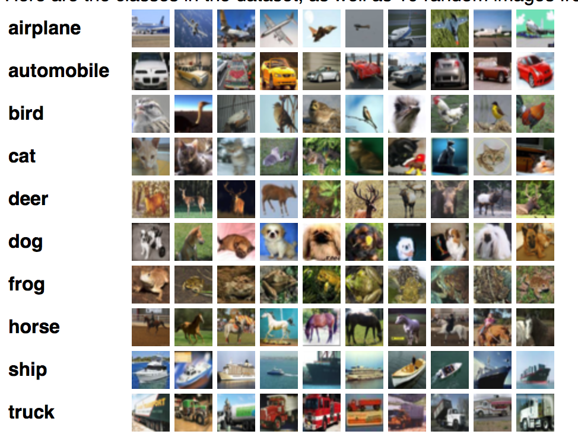

# TransferLearning
**Udacity - Artificial Intelligence Nanodegree Program**
AI - Transfer Learning in Keras.

# Transfer Learning in Keras

This project is part of **Udacity´s Artificial Intelligence Nanodegree Program**. Here you will find my personal solution to the challenge. The following project can be run using a Local Machine or using an external GPU (Solution provided by **Amazon Web Services** is recommended). Next, you can follow Udacitys instructions to install the necessary dependencies on a local machine or on AWS.

Follow the instructions to install the required environment and then you can check:

	(pmaienv)$ jupyter notebook transfer_learning.ipynb

Also check:

	(pmaienv)$ jupyter notebbok bottleneck_features.ipynb


## CIFAR-10 Dataset
In this project, we are using the [Cifar-10 dataset](https://www.cs.toronto.edu/~kriz/cifar.html).
The **CIFAR-10** dataset consists of 60000 32x32 colour images in 10 classes, with 6000 images per class. There are 50000 training images and 10000 test images.

The dataset is divided into five training batches and one test batch, each with 10000 images. The test batch contains exactly 1000 randomly-selected images from each class. The training batches contain the remaining images in random order, but some training batches may contain more images from one class than another. Between them, the training batches contain exactly 5000 images from each class.

Here are the classes in the dataset, as well as 10 random images from each:



--------------------------------------------------------------------------------------------------------

### Instructions - Udacity Project

1. Clone the repository and navigate to the downloaded folder.

```
    $ git clone https://github.com/pablomateo/TransferLearning.git
    $ cd TransferLearning
```

2. (Optional) __If you plan to install TensorFlow with GPU support on your local machine__, follow [the guide](https://www.tensorflow.org/install/) to install the necessary NVIDIA software on your system.  If you are using an EC2 GPU instance, you can skip this step.

3. (Optional) **If you are running the project on your local machine (and not using AWS)**, create (and activate) a new environment.

	- __Linux__ (to install with __GPU support__, change `requirements/pmaienv-linux.yml` to `requirements/pmaienv-linux-gpu.yml`):
	```
    $ conda env create -f requirements/pmaienv-linux.yml
    $ source activate pmaienv-project
	```  
	- __Mac__ (to install with __GPU support__, change `requirements/pmaienv-mac.yml` to `requirements/pmaienv-mac-gpu.yml`):
	```
    $ conda env create -f requirements/pmaienv-mac.yml
    $ source activate pmaienv-project
	```  
	- __Windows__ (to install with __GPU support__, change `requirements/pmaienv-windows.yml` to `requirements/pmaienv-windows-gpu.yml`):  
	```
    $ conda env create -f requirements/pmaienv-windows.yml
    $ activate pmaienv-project
	```

4. (Optional) **If you are running the project on your local machine (and not using AWS)** and Step 6 throws errors, try this __alternative__ step to create your environment.

	- __Linux__ or __Mac__ (to install with __GPU support__, change `requirements/requirements.txt` to `requirements/requirements-gpu.txt`):
	```
    $ conda create --name pmaienv-project python=3.5
    $ source activate pmaienv-project
    (pmaienv)$ pip install -r requirements/requirements.txt
	```  
	- __Windows__ (to install with __GPU support__, change `requirements/requirements.txt` to `requirements/requirements-gpu.txt`):  
	```
    $ conda create --name pmaienv-project python=3.5
    $ activate pmaienv-project
    (pmaienv)$ pip install -r requirements/requirements.txt
	```

5. (Optional) **If you are using AWS**, install Tensorflow.
```
    (pmaienv)$ sudo python3 -m pip install -r requirements/requirements-gpu.txt
```

6. Switch [Keras backend](https://keras.io/backend/) to TensorFlow.
	- __Linux__ or __Mac__: 
		```
		(pmaienv)$ KERAS_BACKEND=tensorflow python -c "from keras import backend"
		```
	- __Windows__: 
		```
		(pmaienv)$ set KERAS_BACKEND=tensorflow
		(pmaienv)$ python -c "from keras import backend"
		```

7. (Optional) **If you are running the project on your local machine (and not using AWS)**, create an [IPython kernel](http://ipython.readthedocs.io/en/stable/install/kernel_install.html) for the `pmaienv-project` environment.
```
    (pmaienv)$ python -m ipykernel install --user --name pmaienv-project --display-name "pmaienv-project"
```

8. Launch Jupyter notebook.
```
    (pmaienv)$ jupyter notebook transfer_learning.ipynb
```

9. (Optional) **If you are running the project on your local machine (and not using AWS)**, before running code, change the kernel to match the pmaienv-project environment by using the drop-down menu (**Kernel > Change kernel > pmaienv-project**).
